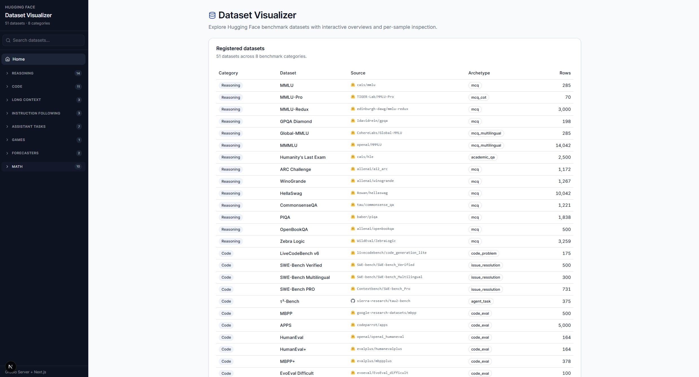
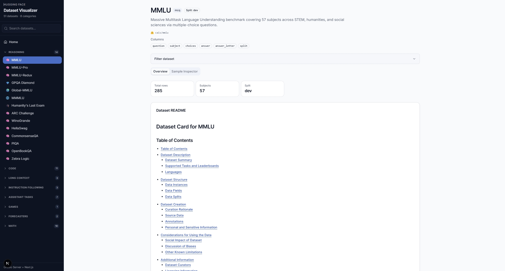
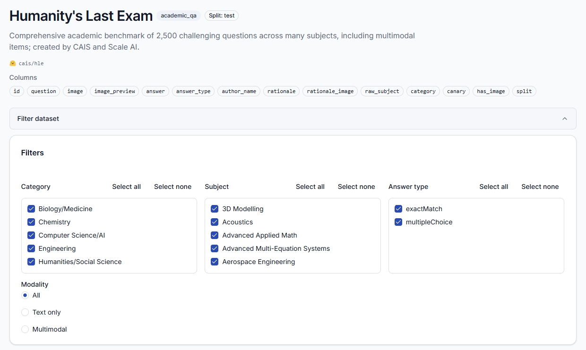
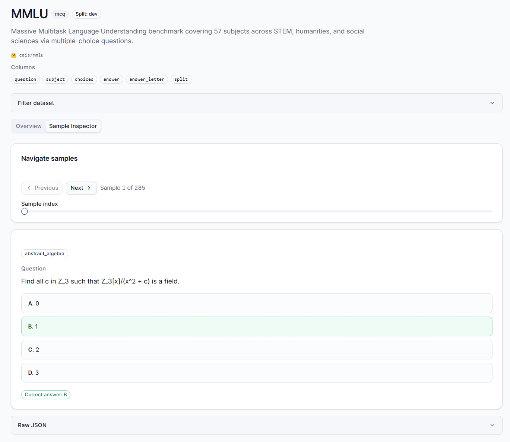
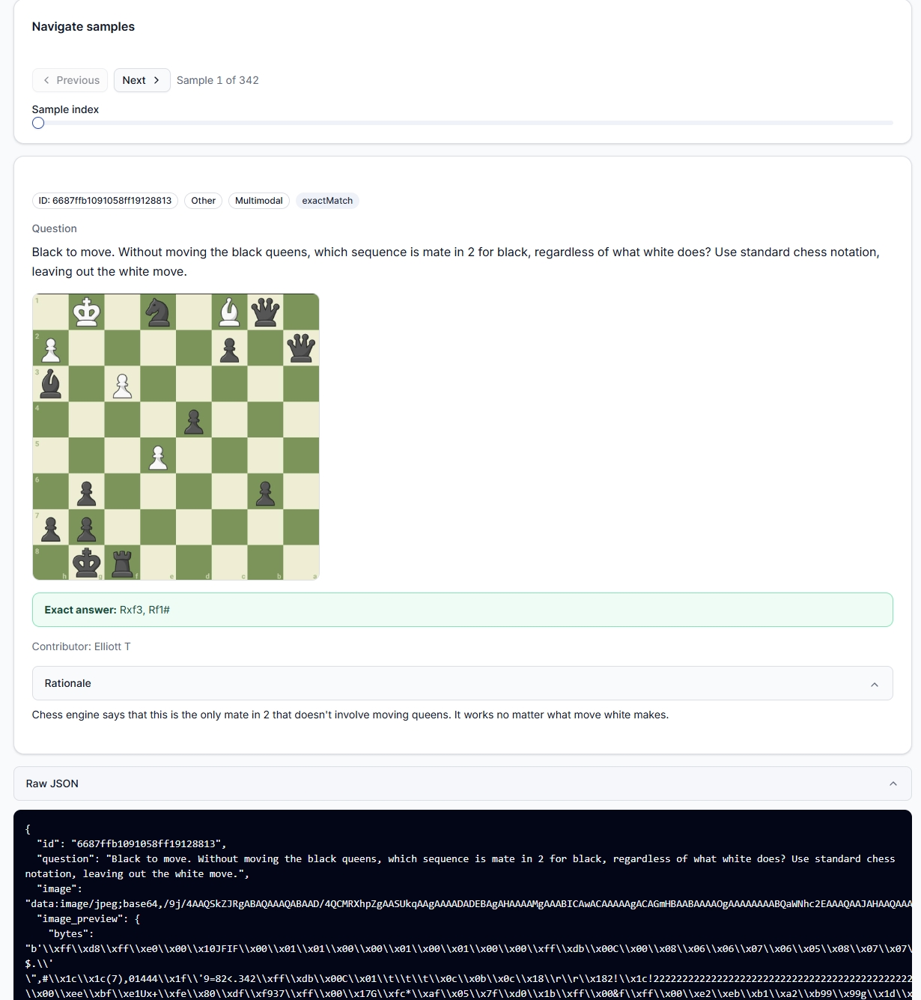
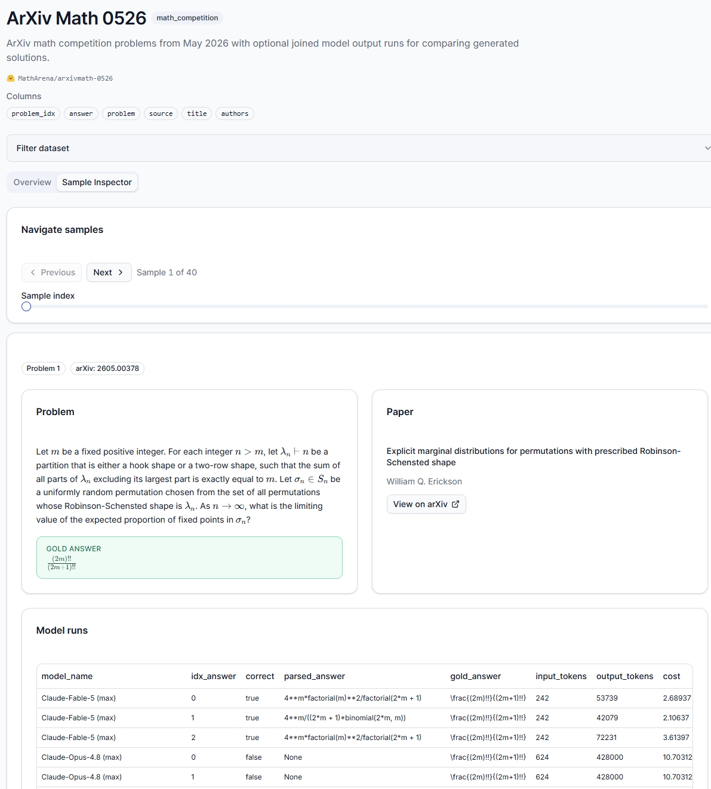
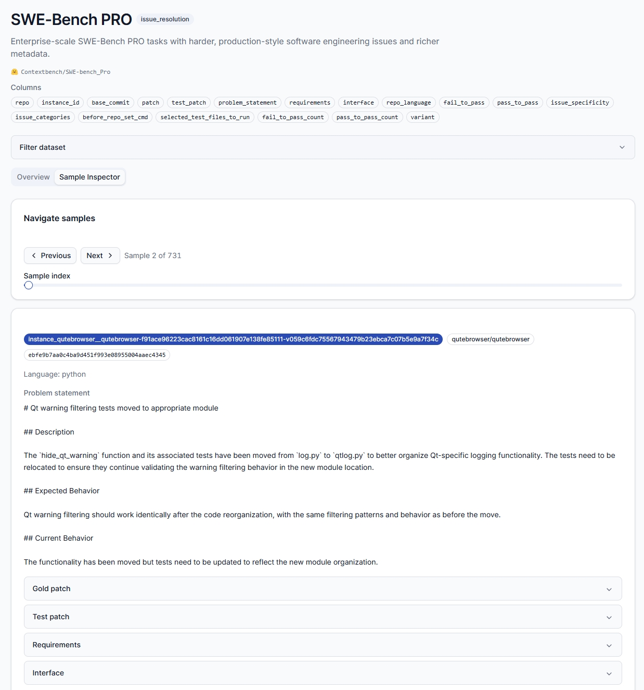

# Dataset Visualizer

Interactive explorer for Hugging Face benchmark datasets. The app uses a **Gradio Server** backend ([`gradio.Server`](https://huggingface.co/blog/introducing-gradio-server)) and a **Next.js** React frontend with benchmark-aware overviews, filters, Markdown/LaTeX rendering, and per-sample inspection.

## Setup

```bash
uv sync
cp .env.example .env
cd frontend && npm install
```

Set `HF_TOKEN` in `.env` to your [Hugging Face access token](https://huggingface.co/settings/tokens). The app loads `.env` at startup; `huggingface_hub` uses `HF_TOKEN` automatically for faster downloads and higher rate limits. Without a token, downloads still work but may be slower. Some datasets (e.g. GPQA Diamond, GAIA) are gated and require a token with accepted terms.

## Run (development)

Start the Gradio API backend:

```bash
uv run dataset-viz
```

In a second terminal, start the Next.js frontend (proxies API calls to port 7860):

```bash
cd frontend
NEXT_PUBLIC_API_URL=http://localhost:7860 npm run dev
```

Open [http://localhost:3000](http://localhost:3000).

### Pre-download datasets (optional)

Warm the local Hugging Face cache before starting the backend so first page loads are faster:

```bash
uv run pre-download --fast              # small smoke-test subset
uv run pre-download --id mmlu           # one dataset
uv run pre-download --category reasoning
uv run pre-download                     # full catalog (large; may take a while)
uv run pre-download --skip-gated        # skip datasets that need HF terms/token
uv run pre-download --workers 8         # parallel downloads (default: 4; use 1 for sequential)
```

Gated datasets (GPQA, GAIA, HLE, …) print a warning when access fails — set `HF_TOKEN` and accept dataset terms on the Hub. Parallel downloads speed up full-catalog runs; without `HF_TOKEN` you may hit Hub rate limits if `--workers` is very high.

Optional direct backend launch:

```bash
uv run python src/dataset_visualizer/server.py
```

## Production build

Build the static Next.js export and serve it from the Gradio server. Start the backend first so the build can fetch the catalog for static routes:

```bash
uv run dataset-viz   # terminal 1 — keep running
cd frontend
NEXT_PUBLIC_API_URL=http://localhost:7860 npm run build
cd ..
```

The backend serves `frontend/out/` at `/` when the build exists.

## Datasets

The catalog in [`config/datasets.yaml`](config/datasets.yaml) currently lists **51 benchmarks** across reasoning, code, long-context, instruction-following, tool-calling, assistant-tasks, games, forecasting, and math.

- **13 manual loaders** — tailored normalization and overviews (MMLU, SWE-bench, LiveCodeBench, …).
- **38 `hf_benchmark` entries** — YAML-only registration; shared loader, profile-based normalization, and generic overviews.

To add a dataset:

- Standard Hub benchmark → [`docs/how-to/add-hf-benchmark.md`](docs/how-to/add-hf-benchmark.md)
- Custom loader logic → [`docs/how-to/add-dataset.md`](docs/how-to/add-dataset.md)

Full reference: [`docs/dataset-system.md`](docs/dataset-system.md). **Update docs and this README when you change setup or architecture.**

### Visual audit

Every catalog dataset has a dedicated Sample Inspector viewer and column glossary on Overview:

- Audit matrix: [`docs/audit/dataset-audit-matrix.md`](docs/audit/dataset-audit-matrix.md)

Regenerate the matrix with `uv run python scripts/audit_datasets.py`. Optional local screenshots: `uv run python scripts/capture_audit_screenshots.py` (writes to `docs/images/audit/`, gitignored).

Per-dataset schema notes (manual loaders and special cases): [`docs/index.md`](docs/index.md).

## Cache

Per-dataset cache directories are created under `data/cache/<key>/` (gitignored) and shown by the inspect CLI. Keys are typically the config `id` for `hf_benchmark` entries, or the loader/cache_key for manual loaders (e.g. `swe_bench` shared by three SWE variants). Hugging Face dataset downloads are also cached in the standard Hugging Face hub cache. First load may take a while; subsequent runs reuse in-process loader caching and the Hugging Face cache.

## Inspect CLI

Inspect schema and a sample row without opening the app:

```bash
uv run python scripts/inspect_dataset.py <dataset_id>
```

`<dataset_id>` is the config `id` from `config/datasets.yaml` (e.g. `mmlu`, `humaneval`, `arc_agi_2`). On error, the CLI prints all valid ids. Prints columns, dtypes, row count, one truncated sample row, and the on-disk cache path.

Examples:

```bash
uv run python scripts/inspect_dataset.py mmlu
uv run python scripts/inspect_dataset.py humaneval
uv run python scripts/inspect_dataset.py arc_agi_2
uv run python scripts/inspect_dataset.py arxivmath_0526
```

## Development

```bash
uv run pytest
uv run ruff check src tests scripts
uv run ruff format src tests scripts
cd frontend && npm run lint
cd frontend && npm run typecheck
```

See [`docs/index.md`](docs/index.md) for architecture, glossary, and per-dataset notes.

## Screenshots

**Home** — browse 51 registered benchmarks by category, archetype, and row count.



**Overview** — summary metric cards and the dataset README ([MMLU](https://huggingface.co/datasets/cais/mmlu), dev split).



**Filters** — schema-driven multiselect and radio filters ([Humanity's Last Exam](https://huggingface.co/datasets/cais/hle)).



**Sample Inspector** — per-dataset viewers with Markdown/LaTeX rendering, highlighted answers, and raw JSON.

MCQ ([MMLU](https://huggingface.co/datasets/cais/mmlu)):



Multimodal academic QA ([HLE](https://huggingface.co/datasets/cais/hle)):



Math competition + model runs ([ArXiv Math 0526](https://huggingface.co/datasets/ArtificialAnalysis/arxivmath_0526)):



Issue resolution ([SWE-Bench PRO](https://huggingface.co/datasets/ScaleAI/SWE-bench_Pro)):


