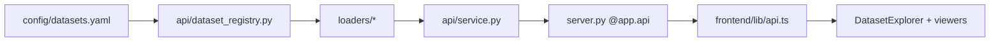
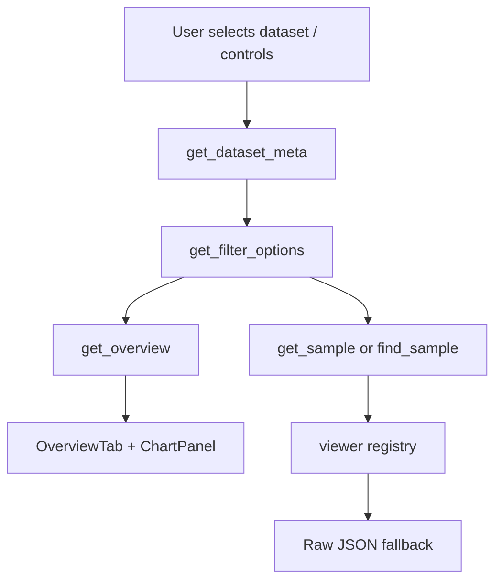

# Architecture overview

The Dataset Visualizer is a Gradio Server API plus a static-exportable Next.js frontend. Dataset metadata lives in YAML, Python loaders normalize benchmark rows, API services return chart/sample payloads, and React viewers render overviews plus per-sample inspection.

## System boundaries

## Data flow

## Visualizer notes

- Generic Hugging Face benchmarks use normalized columns to produce reusable charts: category bars, answer distribution, choice/test-count histograms, text-length histograms, and date timelines.
- Sample viewers are keyed by API `viewer`; the YAML `viewer` field can override the archetype when a benchmark needs a more specific presentation.
- Math and benchmark statements render Markdown/LaTeX via the shared frontend renderer.
