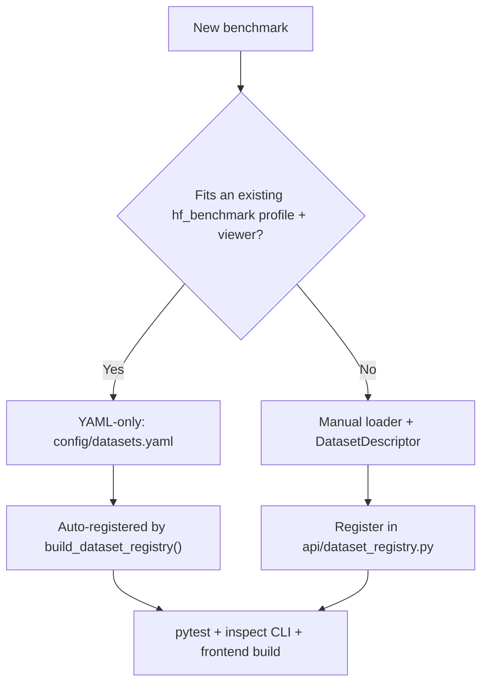

# How to add a dataset

Goal-oriented playbook for registering a new benchmark. Read [dataset-system.md](../dataset-system.md) for full contracts; use this file for the decision tree and verification steps.

## Choose a path



| Path | When to use | Primary doc |
|------|-------------|-------------|
| **YAML-only (`hf_benchmark`)** | Standard Hub dataset; existing `profile` in `benchmark_normalize.py` | [add-hf-benchmark.md](add-hf-benchmark.md) |
| **Manual loader** | Custom download, joins, GitHub JSON, JSONL from repo files, gated workarounds | Below + [dataset-system.md](../dataset-system.md) |

## Manual loader checklist

- [ ] **Config** — [`config/datasets.yaml`](../../config/datasets.yaml): `id`, `label`, `loader`, `description`, `icon`, `archetype`, HF metadata
- [ ] **Loader** — `src/dataset_visualizer/loaders/<module>.py`: `@loader_cache`, `cache_dir()`, normalized `DataFrame`, safe `loader({})` defaults
- [ ] **Registry** — `DatasetDescriptor` in [`api/dataset_registry.py`](../../src/dataset_visualizer/api/dataset_registry.py)
- [ ] **Overview** — `overview_<dataset>()` in [`api/overview.py`](../../src/dataset_visualizer/api/overview.py) or reuse an existing builder
- [ ] **Viewer** — only if no existing `viewer` key fits; register in [`registry.tsx`](../../frontend/components/viewers/registry.tsx)
- [ ] **`cache_key`** — on descriptor when cache dir ≠ config `loader` (e.g. SWE-bench family → `swe_bench`)
- [ ] **Tests** — `tests/test_loaders_<module>.py` with mocked HF; optional smoke in `tests/test_api_service.py`
- [ ] **Docs** — `docs/datasets/<name>.md` when schema is non-trivial; link from [`index.md`](../index.md)

`server.py` and frontend route lists do **not** need changes for standard datasets.

## Pick an archetype (manual path)

See [archetype reference](../dataset-system.md#archetype-reference) for normalized columns and mirror datasets.

| Archetype | Reference `id` | `viewer` |
|-----------|----------------|----------|
| MCQ | `mmlu` | `mcq` |
| MCQ + CoT | `mmlu_pro` | `mcq_cot` |
| MCQ multilingual | `global_mmlu`, `mmmlu` | `mcq` |
| Code generation | `livecodebench_v6` | `code_problem` |
| Issue resolution | `swe_bench_verified` | `issue_resolution` |
| Agent task | `tau3_bench` | `agent_task` |
| Academic QA | `hle` | `academic_qa` |
| Math final-answer | `aime_2026` | `math_competition` |
| Math + model runs | `arxivmath_0526` | `arxiv_math` |
| Code eval (HF generic) | `humaneval` | `code_eval` |
| Generic pass-through | `ruler` | `generic` |
| ARC grid | `arc_agi_2` | `arc_grid` |

## Verify

```bash
uv run pytest
uv run ruff check src tests scripts
uv run python scripts/inspect_dataset.py <dataset_id>
```

Frontend (backend must be running for static route export):

```bash
uv run dataset-viz   # terminal 1
cd frontend && NEXT_PUBLIC_API_URL=http://localhost:7860 npm run build
```

## Documentation updates

When registration steps or architecture change, update:

- [`dataset-system.md`](../dataset-system.md) — contracts and lookup tables
- This file or [add-hf-benchmark.md](add-hf-benchmark.md)
- [`docs/index.md`](../index.md) and [`README.md`](../../README.md) when user-facing behavior changes
